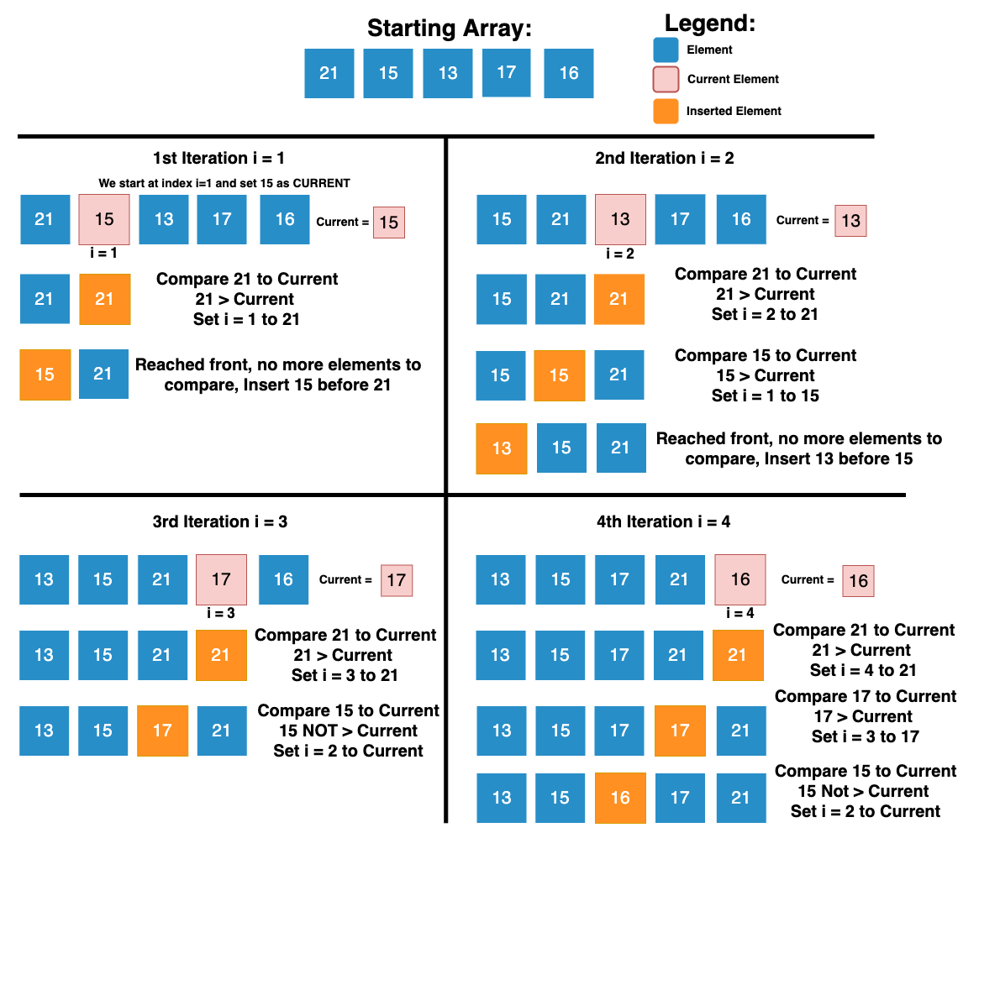

### Steps to Sort an Unsorted Array with Insertion Sort Algorithm
- The first element (index 0) in the array is already sorted (There are no other elements to compare it to).
- Take the second element (index 1), let us refer to this element as *current*.
- Compare *current* to the first element. If the first element is greater than *current*, place current before (to the left) the first element.
- This one move is an iteration of Insertion Sort. If current is the greatest element and is not moved, this too is one iteration.
- Now the process begins again. Take the next element and compare it to the sorted elements to the left of it, beginning with the closest element and moving towards the start of the array.

